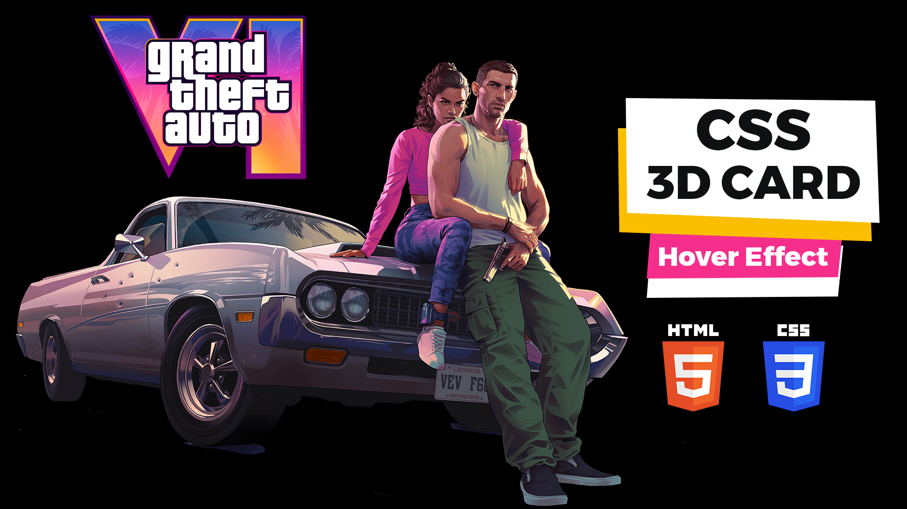

# GTA 6 3D Card Hover Effect | Grand Theft Auto VI 3D Card

The GTA VI 3D Card Hover Effect, inspired by the Grand Theft Auto VI aesthetic, is a visually captivating design element for web pages. Created using HTML, CSS, and potentially JavaScript, this effect introduces a three-dimensional transformation to card elements when a user hovers over them. It may incorporate dynamic features such as rotations, scale adjustments, or shadows to simulate depth and movement, delivering an immersive and engaging user experience. The GTA VI 3D Card Hover Effect is a stylish and interactive design choice, reminiscent of the iconic graphics from the popular video game series, providing a touch of modernity and dynamism to web interfaces.

Youtube Tutorial Link: https://youtu.be/sKMXJDJQsOQ

